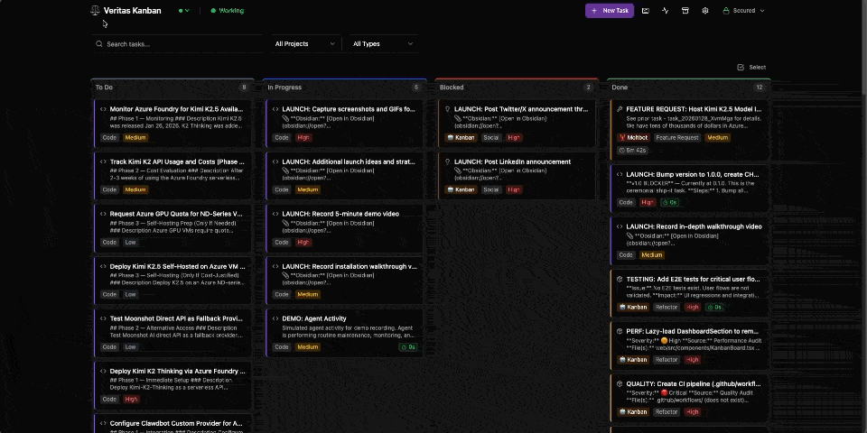
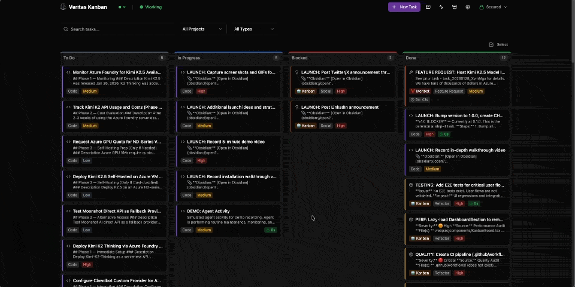
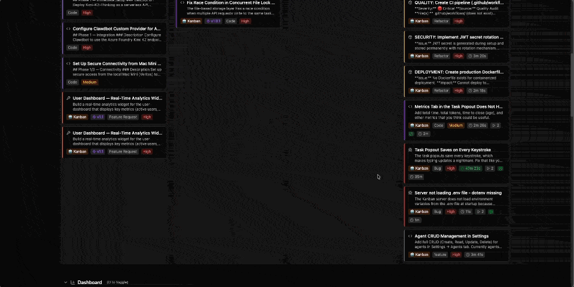

<div align="center">

# ⚖️ Veritas Kanban

_Veritas in actis — Truth in action._

**Local-first task management and AI agent orchestration platform.**

Built for developers who want a visual Kanban board that works with autonomous coding agents.

[](https://github.com/BradGroux/veritas-kanban/actions/workflows/ci.yml)
[](LICENSE)
[](CHANGELOG.md)
[](https://www.typescriptlang.org/)
[](CONTRIBUTING.md)



> 🎬 [Watch the full demo video (MP4)](assets/demo-overview.mp4)

⭐ **If you find this useful, star the repo — it helps others discover it!**

[Quickstart](#-quickstart) · [Features](#-feature-highlights) · [All Features](docs/FEATURES.md) · [Docs](docs/) · [API](#-api-versioning) · [Agent Integration](#-agent-integration) · [MCP Server](#-mcp-server) · [Contributing](CONTRIBUTING.md) · [Changelog](CHANGELOG.md)

</div>

---

Created by **Brad Groux** — CEO of [Digital Meld](https://digitalmeld.io), and host of the [Start Small, Think Big](https://podcasts.apple.com/us/podcast/start-small-think-big-a-podcast-and-newsletter/id1802232903) podcast · [LinkedIn](https://www.linkedin.com/in/bradgroux/) · [Twitter](https://twitter.com/BradGroux) · [YouTube](https://www.youtube.com/bradgroux)

---

## ⚡ Quickstart

Get up and running in under 5 minutes:

```bash
git clone https://github.com/BradGroux/veritas-kanban.git
cd veritas-kanban
pnpm install
cp server/.env.example server/.env   # Edit to change VERITAS_ADMIN_KEY
pnpm dev
```

Open [http://localhost:3000](http://localhost:3000) — that's it. The board auto-seeds with example tasks on first run so you can explore right away.

> **Want a clean slate?** Delete the example tasks: `rm tasks/active/task_example_*.md` and refresh.
> **Want to re-seed?** Run `pnpm seed` to restore the example tasks (only works when the board is empty).

> **Note:** Never commit `.env` files. Use `.env.example` as a template — it contains safe placeholder values and documentation for every variable.

---

## ⚠️ Agentic AI Safety

> [!CAUTION]
> **AI agents can write code, execute commands, and modify your system.** While tools like Veritas Kanban make agentic workflows powerful, they can also cause real damage without proper guardrails. Read this before giving any AI agent access to your environment.

### Best Practices for Agentic AI

1. **Run locally first.** Keep your board and agents on your own machine until you fully understand the behavior. Never expose an unauthenticated instance to the internet.

2. **Never trigger agents from uncontrolled inputs.** Don't let inbound emails, webhooks from third parties, or public form submissions automatically spawn agent work. An attacker who can craft an input can control your agent.

3. **Principle of least privilege.** Give agents the minimum permissions they need. Use the `agent` role (not `admin`) for API keys. Restrict file system access. Don't run agents as root.

4. **Review before merge.** Agents can write code — that doesn't mean the code is correct or safe. Always review agent-generated code before merging to production branches. Use the built-in code review workflow.

5. **Set boundaries on destructive actions.** Agents should not have unsupervised access to `rm`, `git push --force`, database drops, or production deployments. Require human approval for irreversible operations.

6. **Monitor and audit.** Use time tracking and activity logs to understand what agents are doing. Review agent-completed tasks. Check git diffs before pushing.

7. **Rotate credentials regularly.** If an agent has access to API keys, tokens, or secrets, rotate them on a schedule. Don't embed real credentials in task descriptions or prompts.

8. **Isolate environments.** Run agents in containers, VMs, or sandboxed environments when possible. Keep agent workspaces separate from sensitive data.

**The bottom line:** Agentic AI is transformational, but it amplifies both your capabilities and your mistakes. Plan accordingly, start small, and add autonomy gradually as you build confidence in your guardrails.

---

## ✨ Feature Highlights

> 📋 **Full feature reference:** [docs/FEATURES.md](docs/FEATURES.md)

### 📋 Core Board



- **Drag-and-drop Kanban** — Move tasks across To Do, In Progress, Review, Done
- **Markdown storage** — Human-readable task files with YAML frontmatter
- **Dark/light mode** — Toggle between dark and light themes in Settings

### 🔀 Code Workflow

- **Git worktrees** — Isolated branches per task, automatic cleanup
- **Code review** — Unified diff viewer with inline comments
- **Approval workflow** — Approve, request changes, or reject
- **Merge conflicts** — Visual conflict resolution UI
- **GitHub PRs** — Create pull requests directly from task detail

### 🤖 AI Agents

- **Agent orchestration** — Spawn autonomous coding agents on tasks
- **Custom agents** — Add your own agents with any name and command; not limited to built-in types
- **Platform-agnostic API** — REST endpoints work with any agentic platform
- **Built-in Moltbot support** — Native integration with [Moltbot](https://github.com/moltbot/moltbot) (formerly Clawdbot)
- **Multiple attempts** — Retry with different agents, preserve history
- **Running indicator** — Visual feedback when agents are working

### 🗂️ Organization



> 🎬 [Watch the task workflow demo (MP4)](assets/demo-task.mp4)

- **Subtasks** — Break down complex work with progress tracking
- **Dependencies** — Block tasks until prerequisites complete
- **Archive** — Searchable archive with one-click restore
- **Time tracking** — Start/stop timer or manual entry
- **Activity log** — Full history of task events

### ⚙️ Settings & Customization

- **Modular settings** — 8 focused tabs (General, Board, Tasks, Agents, Data, Notifications, Security, Manage)
- **Security hardened** — XSS prevention, path traversal blocking, prototype pollution protection
- **WCAG 2.1 AA** — Full accessibility with ARIA labels, keyboard navigation
- **Error boundaries** — Crash isolation per tab with recovery options
- **Performance** — Lazy-loaded tabs, memoized components, debounced saves
- **Import/Export** — Backup and restore all settings with validation

### 🔌 Integration

- **CLI** — `vk` command for terminal workflows
- **MCP Server** — Model Context Protocol for AI assistants
- **Notifications** — Teams integration for task updates

---

## 🛠️ Tech Stack

| Layer               | Technology                           | Version                        |
| ------------------- | ------------------------------------ | ------------------------------ |
| **Frontend**        | React, Vite, Tailwind CSS, Shadcn UI | React 19, Vite 6, Tailwind 3.4 |
| **Backend**         | Express, WebSocket                   | Express 4.21                   |
| **Language**        | TypeScript (strict mode)             | 5.7                            |
| **Storage**         | Markdown files with YAML frontmatter | gray-matter                    |
| **Git**             | simple-git, worktree management      | —                              |
| **Testing**         | Playwright (E2E), Vitest (unit)      | Playwright 1.58, Vitest 4      |
| **Runtime**         | Node.js                              | 22+                            |
| **Package Manager** | pnpm                                 | 9+                             |

---

## 🏆 Why Veritas Kanban?

| Feature                      | Veritas Kanban |   Jira   | Linear |    Plane     |    Planka    |
| ---------------------------- | :------------: | :------: | :----: | :----------: | :----------: |
| **Open source**              |     ✅ MIT     |    ❌    |   ❌   |   ✅ AGPL    | ✅ Fair Use  |
| **Local-first**              |       ✅       |    ❌    |   ❌   | ⚠️ Self-host | ⚠️ Self-host |
| **AI agent orchestration**   |   ✅ Native    |    ❌    |   ❌   |      ❌      |      ❌      |
| **MCP server**               |       ✅       |    ❌    |   ❌   |      ❌      |      ❌      |
| **CLI**                      |       ✅       |    ❌    |   ✅   |      ❌      |      ❌      |
| **Git worktree integration** |       ✅       |    ❌    |   ❌   |      ❌      |      ❌      |
| **Code review built-in**     |       ✅       |    ❌    |   ❌   |      ❌      |      ❌      |
| **Markdown file storage**    |       ✅       |    ❌    |   ❌   |      ❌      |      ❌      |
| **No database required**     |       ✅       |    ❌    |   ❌   |      ❌      |      ❌      |
| **Time tracking**            |       ✅       | ✅ Addon |   ❌   |      ✅      |      ❌      |
| **Real-time WebSocket**      |       ✅       |    ✅    |   ✅   |      ✅      |      ✅      |
| **REST API**                 |       ✅       |    ✅    |   ✅   |      ✅      |      ✅      |
| **Free forever**             |       ✅       |    ❌    |   ❌   |  ⚠️ Limits   |      ✅      |

**Veritas Kanban is built for developers and AI agents.** If your workflow involves autonomous coding agents, git-integrated task management, or you just want a board that stores data as plain files you can `grep` — this is it.

---

## 🔄 How It Works

```
  Any AI Agent / CLI / MCP Client
           │
           ▼
┌──────────────────────────────┐
│      REST API + WebSocket    │
│    http://localhost:3001     │
│                              │
│  ┌───────┐  ┌───────────┐    │
│  │ Tasks │  │  Agents   │    │
│  │  API  │  │  Service  │    │
│  └───┬───┘  └─────┬─────┘    │
│      │            │          │
│      ▼            ▼          │
│   Markdown    Agent Request  │
│    Files       Files (.json) │
└──────────────────────────────┘
           │
           ▼
   React 19 + Vite Frontend
   http://localhost:3000
```

The board is the source of truth. Agents interact via the REST API — create tasks, update status, track time, submit completions. The frontend reflects everything in real time over WebSocket. No vendor lock-in: if it can make HTTP calls, it can drive the board.

---

## 🏗️ Architecture

```
veritas-kanban/                  ← pnpm monorepo
│
├── web/                         ← React 19 + Vite frontend
│   └── src/
│       ├── components/          ← UI components (Shadcn + custom)
│       ├── hooks/               ← React Query hooks, WebSocket
│       └── lib/                 ← Utilities, API client
│
├── server/                      ← Express + WebSocket API
│   └── src/
│       ├── routes/              ← REST endpoints (/api/v1/*)
│       ├── services/            ← Business logic
│       └── middleware/          ← Auth, rate limiting, security
│
├── shared/                      ← TypeScript types & contracts
│   └── src/types/               ← Shared between web & server
│
├── cli/                         ← `vk` CLI tool
├── mcp/                         ← MCP server for AI assistants
├── docs/                        ← Sprint & audit documentation
│
├── tasks/                       ← Task storage (Markdown files)
│   ├── active/                  ← Current tasks (.gitignored)
│   ├── archive/                 ← Archived tasks (.gitignored)
│   └── examples/                ← Seed tasks for first-run
│
└── .veritas-kanban/             ← Runtime config & data
    ├── config.json
    ├── worktrees/
    ├── logs/
    └── agent-requests/
```

**Data flow:** Web ↔ REST API / WebSocket ↔ Server ↔ Markdown files on disk

---

## 📖 API Versioning

All API endpoints support versioned paths. The current (and default) version is **v1**.

| Path            | Description                             |
| --------------- | --------------------------------------- |
| `/api/v1/tasks` | Canonical versioned endpoint            |
| `/api/tasks`    | Backwards-compatible alias (same as v1) |

Every response includes an `X-API-Version: v1` header. Clients may optionally request a specific version:

```bash
curl -H "X-API-Version: v1" http://localhost:3001/api/tasks
```

- **Non-breaking changes** (new fields, new endpoints) are added to the current version.
- **Breaking changes** will introduce a new version (`v2`). The previous version remains available during a deprecation period.
- The unversioned `/api/...` alias always points to the latest stable version.

---

## 💻 CLI

```bash
# Install globally
cd cli && npm link

# Task management
vk list                          # List all tasks
vk list --status in-progress     # Filter by status
vk show <id>                     # Task details
vk create "Title" --type code    # Create task
vk update <id> --status review   # Update task

# Agent commands
vk agents:pending                # List pending agent requests
vk agents:status <id>            # Check if agent running
vk agents:complete <id> -s       # Mark agent complete

# Utilities
vk summary                       # Project stats
vk notify:pending                # Check notifications
```

---

## 🤖 Agent Integration

Veritas Kanban works with any agentic platform that can make HTTP calls. The REST API covers the full task lifecycle — create, update, track time, complete.

Built and tested with [Moltbot](https://github.com/moltbot/moltbot) (formerly Clawdbot), which provides native orchestration via `sessions_spawn`. The built-in agent service targets Moltbot — PRs welcome for adapters to other platforms.

### How It Works

1. **Start Agent** — Click "Start Agent" in the UI on a code task (or hit the API directly)
2. **Request Created** — Server writes to `.veritas-kanban/agent-requests/`
3. **Agent Picks Up** — Your agent reads the request and begins work
4. **Work Happens** — Agent updates task status, tracks time, commits code
5. **Completion** — Agent calls the completion endpoint with results
6. **Task Updates** — Status moves to Review, notifications sent

### Any Platform (REST API)

```bash
# Create a task
curl -X POST http://localhost:3001/api/tasks \
  -H "Content-Type: application/json" \
  -H "X-API-Key: $YOUR_KEY" \
  -d '{"title": "Implement feature X", "type": "code", "status": "in-progress"}'

# Start time tracking
curl -X POST http://localhost:3001/api/tasks/<id>/time/start \
  -H "X-API-Key: $YOUR_KEY"

# Mark complete
curl -X POST http://localhost:3001/api/agents/<id>/complete \
  -H "Content-Type: application/json" \
  -H "X-API-Key: $YOUR_KEY" \
  -d '{"success": true, "summary": "What was done"}'
```

### Moltbot (Native)

```bash
# Check for pending agent requests
vk agents:pending

# Moltbot sub-agents use sessions_spawn to execute work,
# then call the completion endpoint automatically.
```

---

## 🔗 MCP Server

For AI assistants (Claude Desktop, etc.):

```json
{
  "mcpServers": {
    "veritas-kanban": {
      "command": "node",
      "args": ["/path/to/veritas-kanban/mcp/dist/index.js"],
      "env": {
        "VK_API_URL": "http://localhost:3001"
      }
    }
  }
}
```

### Available Tools

| Tool           | Description       |
| -------------- | ----------------- |
| `list_tasks`   | List with filters |
| `get_task`     | Get task by ID    |
| `create_task`  | Create new task   |
| `update_task`  | Update fields     |
| `archive_task` | Archive task      |

### Resources

| URI                     | Description          |
| ----------------------- | -------------------- |
| `kanban://tasks`        | All tasks            |
| `kanban://tasks/active` | In-progress + review |
| `kanban://task/{id}`    | Single task          |

---

## 📄 Task Format

Tasks are markdown files with YAML frontmatter:

```markdown
---
id: 'task_20260126_abc123'
title: 'Implement feature X'
type: 'code'
status: 'in-progress'
priority: 'high'
project: 'rubicon'
git:
  repo: 'my-project'
  branch: 'feature/task_abc123'
  baseBranch: 'main'
---

## Description

Task details here...
```

---

## 🧑‍💻 Development

```bash
pnpm dev        # Start dev servers (web + API concurrently)
pnpm build      # Production build
pnpm typecheck  # TypeScript strict check
pnpm lint       # ESLint
pnpm test       # Unit tests (Vitest)
pnpm test:e2e   # E2E tests (Playwright)
```

---

## 📚 Documentation

| Document                              | Description                      |
| ------------------------------------- | -------------------------------- |
| [Features](docs/FEATURES.md)          | Complete feature reference       |
| [Deployment](docs/DEPLOYMENT.md)      | Docker, bare metal, env config   |
| [Contributing](CONTRIBUTING.md)       | How to contribute, PR guidelines |
| [Security Policy](SECURITY.md)        | Vulnerability reporting          |
| [Code of Conduct](CODE_OF_CONDUCT.md) | Community guidelines             |
| [Changelog](CHANGELOG.md)             | Release history                  |
| [Sprint Docs](docs/)                  | Sprint planning & audit reports  |

---

## 📸 Screenshots

<details>
<summary><strong>Click to expand screenshots</strong></summary>

### Board Overview

|                                                    |                                                     |
| -------------------------------------------------- | --------------------------------------------------- |
|  |  |
|    |   |

### Task Management

|                                                             |                                                            |
| ----------------------------------------------------------- | ---------------------------------------------------------- |
|                  |          |
|  |  |

### Task Extras

|                                              |                                                      |
| -------------------------------------------- | ---------------------------------------------------- |
|  |  |
|  |                    |

### Metrics & Dashboard

|                                                    |                                                    |
| -------------------------------------------------- | -------------------------------------------------- |
|        |  |
|  |    |

### Settings

|                                                        |                                                                 |
| ------------------------------------------------------ | --------------------------------------------------------------- |
|    |                 |
|         |                |
|          |  |
|  |               |

### Menus & Activity

|                                                       |                                                               |
| ----------------------------------------------------- | ------------------------------------------------------------- |
|  |  |
|    |                 |

</details>

---

## 🗺️ Roadmap

See the [v1.1 milestone](https://github.com/BradGroux/veritas-kanban/milestone/1) for planned improvements. Community contributions welcome!

- [WCAG 2.1 AA accessibility](https://github.com/BradGroux/veritas-kanban/issues/1)
- [Standardized API response envelope](https://github.com/BradGroux/veritas-kanban/issues/2) · `good first issue`
- [Circuit breaker pattern](https://github.com/BradGroux/veritas-kanban/issues/3)
- [Load testing suite (k6)](https://github.com/BradGroux/veritas-kanban/issues/4) · `good first issue`
- [Prometheus/OpenTelemetry metrics](https://github.com/BradGroux/veritas-kanban/issues/5)
- [Abstract file storage interface](https://github.com/BradGroux/veritas-kanban/issues/6)

---

## 💬 Support

All support and feature requests go through GitHub:

- **🐛 Bug reports** — [Open an issue](https://github.com/BradGroux/veritas-kanban/issues/new?template=bug_report.md)
- **💡 Feature requests** — [Open an issue](https://github.com/BradGroux/veritas-kanban/issues/new?template=feature_request.md)
- **❓ Questions & discussion** — [GitHub Discussions](https://github.com/BradGroux/veritas-kanban/discussions)

> **Note:** Support is not provided via email or social media. GitHub is the single source of truth for all project communication.

---

## 🙏 Acknowledgments

Special thanks to [Peter Steinberger](https://github.com/steipete) and [Moltbot](https://github.com/moltbot/moltbot) (formerly Clawdbot) — the platform that inspired this project and made autonomous agent orchestration feel like magic.

---

## 📜 License

[MIT](LICENSE) © 2026 [Digital Meld](https://digitalmeld.io)

---

<div align="center">

Made in Texas with 💜

Originally built for [Moltbot](https://github.com/moltbot/moltbot). Works with any agentic platform.

</div>
